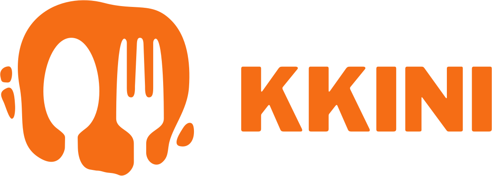

# 랜덤 음식점 추천 및 밥모임 제공 서비스



### 무엇을 먹을지, 누구랑 먹을지 고민하지 말라!

### 배고프다면 합류하라!

<br />
<br />

<strong>Kkini</strong>는 현재 위치에 기반하여 주변의 음식점을 랜덤으로 추천해줍니다. 또한, 혼자서는 두려운 음식점을 방문할 수 있도록 밥모임 모집 서비스를 제공합니다.

식사 해결에 고민하는 시간을 줄이고, 나아가 인연을 만날 수 있는 기회를 제공하며 음식점 현장 방문을 장려하기 위해 Kkini를 기획하였습니다.

### 끼니가 풀고자한 문제

#### `무엇을 먹을지 고민` : 근처 음식점 중 하나 뽑아줌

#### `누구랑 먹을지 고민` : 밥모임을 생성/참여

<br />

[Kkini 서비스 바로가기](https://kkini.vercel.app/)

<br />
<br />

---

<br />
<br />

## Demo

|                                                                  랜덤 음식점 뽑기                                                                  |                                                                  밥모임 생성                                                                  |                                                                  밥모임 상태 변경                                                                  |
| :------------------------------------------------------------------------------------------------------------------------------------------------: | :-------------------------------------------------------------------------------------------------------------------------------------------: | :------------------------------------------------------------------------------------------------------------------------------------------------: |
|  |  |  |

|                                                                  리뷰 작성하기                                                                  |                                                                  신청서 보내기                                                                  |                                                                  신청서 수락 및 거절                                                                  |
| :---------------------------------------------------------------------------------------------------------------------------------------------: | :---------------------------------------------------------------------------------------------------------------------------------------------: | :---------------------------------------------------------------------------------------------------------------------------------------------------: |
|  |  |  |

|                                                                  밥모임 채팅                                                                  |                                                                  카카오, 구글 소셜 로그인                                                                  |                                                                  프로필 이미지, 닉네임, 간단소개 변경                                                                  |
| :-------------------------------------------------------------------------------------------------------------------------------------------: | :--------------------------------------------------------------------------------------------------------------------------------------------------------: | :--------------------------------------------------------------------------------------------------------------------------------------------------------------------: |
|  |  |  |

<br />
<br />

---

<br />
<br />

## 프로젝트 관련 문서

[Git 전략](https://backend-devcourse.notion.site/git-0955f4a3796f4ee88389bd871c4c965b)

[코딩 컨벤션](https://backend-devcourse.notion.site/7e9b90aefbc1425eabe247a7a1e9d8de)

<br />
<br />

---

<br />
<br />

## 팀원

<table>
  <tbody>
  <tr>
  <td align="center"><a href="https://github.com/SDWoo"></a></td>
  <td align="center"><a href="https://github.com/metacode22"></a></td>
  <td align="center"><a href="https://github.com/live-small"></a></td>
  </tr>
  <tr>
  <td align="center"><a href="https://github.com/SDWoo">신동우</a></td>
  <td align="center"><a href="https://github.com/metacode22">신승준</a></td>
  <td align="center"><a href="https://github.com/live-small">한수화</a></td>
  </tr>
  </tbody>
</table>

<br />
<br />

---

<br />
<br />

## 기술 스택

               

<br />
<br />

---

<br />
<br />

## 폴더 구조

- UI랑 비즈니스 로직 분리를 위해 utils, hooks폴더 활용
  - hooks 사용 시, hooks폴더
  - 사용안할 경우, utils

```
src
 ┣ apis
 ┣ components
 ┃ ┣ ...
 ┃ ┗ common # Header, Navigation, Button 등 공통으로 쓰이는 컴포넌트 폴더
 ┣ contexts
 ┃ ┗ kakaoMap # kakao를 통해 만든 객체들을 context로 저장
 ┣ hooks
 ┃ ┣ ...
 ┃ ┗ query # useQuery, useMutation 등 react-query 훅 폴더
 ┣ pages
 ┃ ┣ food-party
 ┃ ┃ ┣ detail
 ┃ ┃ ┃ ┣ chat
 ┃ ┃ ┃ ┃ ┗ [roomId].tsx # 채팅방 페이지
 ┃ ┃ ┃ ┗ [partyId].tsx # 밥모임 상세 페이지
 ┃ ┃ ┣ list
 ┃ ┃ ┃ ┣ restaurant
 ┃ ┃ ┃ ┃ ┗ [placeId].tsx # 음식점으로 검색한 밥모임 목록을 페이지
 ┃ ┃ ┃ ┗ my.tsx # 자신이 참여 중인 밥모임 목록을 보여주는 페이지
 ┃ ┃ ┣ review
 ┃ ┃ ┃ ┗ [partyId].tsx # 밥모임 식사 완료 후 리뷰를 작성할 수 있는 페이지
 ┃ ┃ ┣ application.tsx # 자신이 다른 밥모임에 보낸 신청서, 자신이 만든 밥모임에 들어온 신청서 목록을 보여주는 페이지
 ┃ ┃ ┗ create.tsx # 밥모임을 생성하는 페이지
 ┃ ┣ user
 ┃ ┃ ┣ [userId].tsx # 나의 프로필 페이지
 ┃ ┃ ┗ edit.tsx # 나의 프로필 수정 페이지
 ┃ ┣ 404.tsx
 ┃ ┣ _app.tsx
 ┃ ┣ _document.tsx
 ┃ ┣ index.tsx
 ┃ ┗ oauth.tsx # 소셜 로그인 페이지
 ┣ services # useQuery, useMutation에 사용되는 비즈니스 비동기 로직 폴더
 ┣ stores # recoil로 저장하는 상태들을 정의하는 폴더
 ┣ styles
 ┣ types
 ┗ utils
 ┃ ┣ constants
 ┃ ┣ helpers
 ┃ ┗ validations
```

<br />
<br />

---

<br />
<br />

## 백엔드 레포지토리

https://github.com/prgrms-web-devcourse/Team-DarkNight-Kkini-BE
